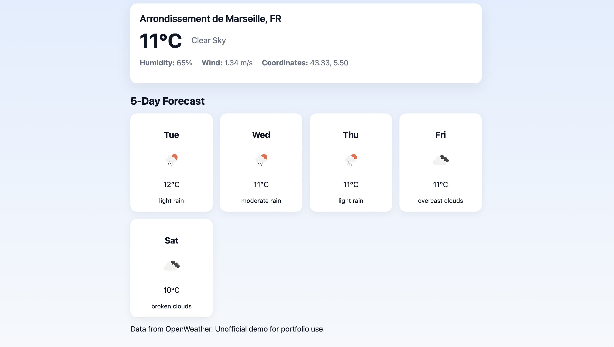

# **Weather App — Portfolio Project**


A simple, responsive weather dashboard that displays current conditions and a 5-day forecast using the OpenWeather API.

---

## 📑 **Table of Contents**

* [Overview](#overview)
* [Features](#features)
* [Screenshots](#screenshots)
* [Live Demo](#live-demo)
* [Project Structure](#project-structure)
* [How to Run the App Locally](#how-to-run-the-app-locally)
* [How It Works](#how-it-works)
* [Deployment](#deployment)
* [API Key Security](#api-key-security)
* [Technologies Used](#technologies-used)
* [For Employers](#for-employers)
* [Video Introduction Script (Optional)](#video-introduction-script-optional)
* [License](#license)

---

## **Overview**

This project demonstrates how to consume a REST API, display weather data, build a clean UI using HTML/CSS/JavaScript, and maintain a professional GitHub workflow. It includes a detailed README, screenshots, and a live deployment.

---

## **Features**

* **Current Weather**: temperature, humidity, wind, description
* **5-Day Forecast**: filtered to 12:00 entries with icons
* **Celsius / Fahrenheit toggle**
* **Responsive modern UI**
* **Dynamic weather icons**
* **Clean grid layout**
* **Robust error handling** (invalid city, rate limits, invalid API key)

---

## **Screenshots**

### Interface


### Current Weather


### 5-Day Forecast



---

## **Live Demo**

▶️ **[https://GizzyB.github.io/weather-app/](https://GizzyB.github.io/weather-app/)**

Enable GitHub Pages under **Settings → Pages** if it’s not already active.

---

## **Project Structure**

```
weather-app/
│
├── index.html
├── style.css
├── script.js
├── README.md
├── LICENSE
└── screenshots/
      ├── interface.png
      ├── result.png
      └── forecast.png
```

---

## **How to Run the App Locally**

### 1. Clone the Repository

```bash
git clone https://github.com/GizzyB/weather-app.git
```

### 2. Insert Your API Key

Open `script.js` and replace:

```js
const API_KEY = "YOUR_API_KEY";
```

⚠️ **Do not upload your real API key to GitHub.**

### 3. Open the App

* Double-click `index.html`, **or**
* Use **VS Code Live Server**

---

## **How It Works**

### **1. Current Weather**

Fetched from:
`/data/2.5/weather`

### **2. 5-Day Forecast**

Fetched from:
`/data/2.5/forecast`
Only entries at **12:00:00** are selected.

### **3. Icons**

From OpenWeather:
`https://openweathermap.org/img/wn/{icon}@2x.png`

### **4. Unit Toggle**

Switches between:

* metric (°C, m/s)
* imperial (°F, mph)

### **5. Error Handling**

Covers:

* Invalid city input
* Invalid API key
* API rate limits

---

## **Deployment**

### **GitHub Pages**

1. Go to **Settings → Pages**
2. Select **Branch: main**
3. Save

### **Netlify**

* Drag-and-drop your project folder
* Get an instant URL

Both methods require **no backend**.

---

## **API Key Security**

Do **NOT** store your API key directly in public repositories.

Safer options:

* Serverless functions (Netlify / Vercel)
* Environment variables
* Backend proxy server

---

## **Technologies Used**

* HTML5
* CSS3
* JavaScript (ES6+)
* Fetch API
* OpenWeather API
* Git & GitHub

---

## **For Employers**

This project demonstrates:

* Real-world REST API integration
* Solid JavaScript logic
* Responsive layout and modern UI
* Problem-solving through error handling
* Clean file organization
* Professional GitHub documentation
* Ability to build a complete project from scratch

---

## **Video Introduction Script (Optional)**

> “Hi, my name is **Gisèle Brown**, and this is my Weather App project. I built it to demonstrate API integration, JavaScript logic, and clean documentation. The app displays current weather conditions and a 5-day forecast with Celsius/Fahrenheit toggling, icons, and error handling. You can try the live version on GitHub Pages and view my code in this repository. Thank you for watching.”

---

## **License**

This project is released under the **MIT License**.
See the `LICENSE` file for details.

---
